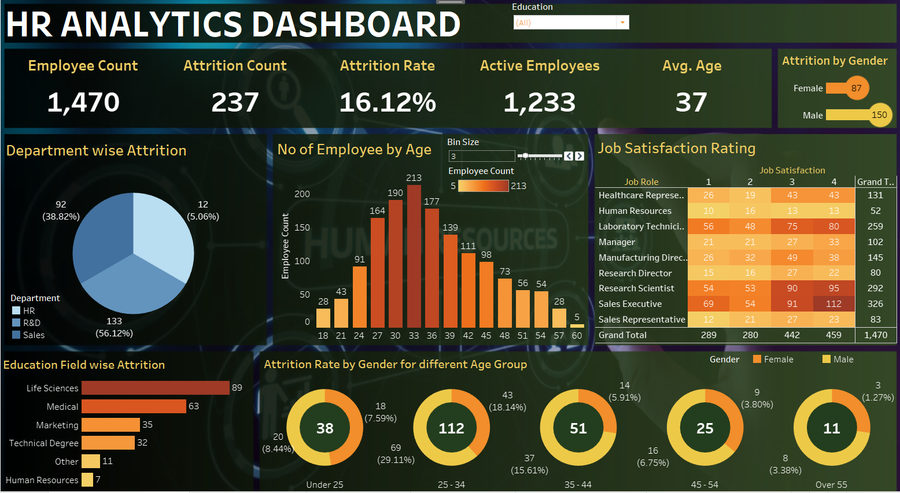

# HR Analytics Dashboard 📊  

This repository contains an **HR Analytics Dashboard** built using **Tableau** to analyze employee data, attrition trends, job satisfaction, and various HR metrics. The dashboard provides key insights to help organizations understand workforce dynamics and improve employee retention strategies.

---

## 🚀 Project Overview  

The **HR Analytics Dashboard** is designed to track **employee attrition**, **job satisfaction**, and **department-wise insights**. The dashboard includes **interactive visualizations** to help HR professionals make data-driven decisions.

### 🔍 **Key Metrics Tracked**:
- **Employee Count** - Total employees in the organization.
- **Attrition Count & Rate** - Number and percentage of employees who left.
- **Active Employees** - Employees currently in the organization.
- **Average Age** - Average age of employees.
- **Attrition by Gender** - Breakdown of attrition by male and female employees.
- **Department-wise Attrition** - Attrition across different departments.
- **Education-wise Attrition** - Attrition categorized by educational background.
- **Job Satisfaction Rating** - Employee satisfaction across different job roles.
- **Attrition Rate by Age & Gender** - Breakdown of attrition across different age groups and genders.
- **Employee Age Distribution** - Segmentation of employees by age.

---

## 📊 Dashboard Components  

### **1️⃣ Employee Overview Panel**
This panel provides a **summary of key HR metrics**, including:
- **Total Employees**
- **Attrition Rate**
- **Number of Active Employees**
- **Average Age of Employees**
- **Attrition by Gender**

### **2️⃣ Department-wise Attrition**
- Displays a **pie chart** showing the percentage of employees leaving across different departments.
- Helps HR teams identify departments with **high attrition rates**.

### **3️⃣ Education Field-wise Attrition**
- A **bar chart** illustrating attrition trends across different educational backgrounds.
- Helps understand whether employees from specific fields are more likely to leave.

### **4️⃣ Employee Age Distribution**
- A **histogram** that segments employees based on age.
- Allows HR to analyze which age groups have the highest attrition.

### **5️⃣ Job Satisfaction Rating**
- A **heatmap visualization** showing satisfaction levels across job roles.
- Helps identify roles where employees report lower satisfaction levels.

### **6️⃣ Attrition Rate by Gender and Age**
- **Donut charts** visualizing attrition rates for different age groups, split by gender.
- Helps HR understand **age-based and gender-based attrition patterns**.

---

## 🛠️ Tools & Technologies Used  

- **Tableau** - For data visualization and interactive dashboards.
- **Excel / CSV** - Data source for employee records.
- **Python (Pandas, NumPy)** - For initial data preprocessing and cleaning.

---

## 📷 Dashboard Preview  

---
---

## 🌐 Live Dashboard  
[🔗 Click here to view the live HR Analytics Dashboard](https://public.tableau.com/views/HRANALYTICSDASHBOARD_17395427510170/HRANALYTICSDASHBOARD?:language=en-US&publish=yes&:sid=&:redirect=auth&:display_count=n&:origin=viz_share_link)  

---

## 💡 Key Insights  

- **Sales Department has the highest attrition rate** compared to other departments.
- **Employees aged 25-34 experience the highest attrition**.
- **Life Sciences graduates have the highest attrition rates**.
- **Job satisfaction varies across roles**, with some roles showing lower scores.
- **Attrition is highest among employees with less than 5 years of experience**.
- **Higher job satisfaction correlates with lower attrition rates**.

---

## 📈 Future Enhancements  

✅ **Integration with real-time HR data** for dynamic updates.  
✅ **Predictive modeling** to forecast attrition trends.  
✅ **Advanced filters** for better employee segmentation.  
✅ **Employee sentiment analysis** based on surveys.  

---

